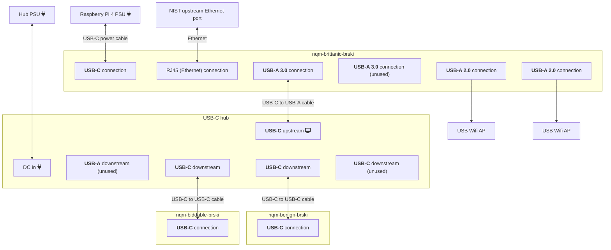

# NIST BRSKI demo setup

The server device for the NIST BRSKI demo has the following requirements:
  - Capability for two independent WiFi APs

The client devices must have the following requirements:
  - Capability for WiFi STA that can connect to the WiFi APs
  - USB Ethernet Gadget mode connectivity

For the BRSKI demo, we're setting up a Raspberry Pi 4B running Ubuntu 22.04
server edition called `nqm-britannic-brski`. For the two WiFi APs, we're using
two Ralink RT5370 USB adapters. That then connects to two Ubuntu 22.04 clients
using a USB-C hub, which are both acting a USB Ethernet devices.



## SSH Connection through brittanic brski

Only `nqm-britannic-brski` is directly connected to the network.

If you want to SSH into `nqm-benign-brski` or `nqm-biddable-brski`, you must
use `ssh 192.168.48.1 -J nqm-britannic-brski.local` (use the IP address, since
mDNS does not work for some reason).

## Setup

### Configuring USB-C connection

In order to enable the USB-C connection for data, you must making the following
change in your `/boot/firmware/config.txt` (`/boot/config.txt` on Raspbian):

#### Host

The Raspberry Pi 4B's USB-C connector does **NOT** support DRD (Dual-Role-Data).
This means that if you use a USB-C to USB-C cable, the Raspberry Pi 4B can only
be peripheral/UFP (upstream-facing port).

There is support for USB 2.0 OTG (USB On-The-Go) in host-mode, but it requires
that you use a USB-C to USB-A/USB-B adapter.

**USB-C to USB-C only works as a periperal**.

Because of this, to connect the Raspberry Pi 4B to a USB-C hub as a host,
**you must plug the hub into one of the Raspberry Pi 4B's USB-A ports**.

See [_RPi 4 USB-C socket as host - Raspberry Pi Forums_][246348]  and
[Texas Instruments. _Transition Existing Products from USB 2.0 OTG to USB Type-CTM_][slly017]
for more info.

[246348]: https://forums.raspberrypi.com/viewtopic.php?t=246348
[slly017]: https://www.ti.com/lit/wp/slly017/slly017.pdf

#### Client USB-C Ethernet

The Raspberry Pi 4B's USB-C connector can be used in
peripheral/UFP (upstream-facing port) mode.

##### Enabling USB peripheral mode in `/boot/firmware/config.txt`

In `/boot/firmware/config.txt`, add the following line, to turn the Raspberry
Pi 4B into a USB gadget:

```
[cm4]
# Enable the USB2 outputs on the IO board (assuming your CM4 is plugged into
# such a board)
dtoverlay=dwc2,dr_mode=peripheral
```

Place it in the `[cm4]` section if it exists.

##### Make the Raspberry Pi a USB Gadget Ethernet using `/boot/firmware/cmdline.txt`

In `/boot/firmware/cmdline.txt`, add

```
modules-load=dwc2,g_ether g_ether.dev_addr=e6:5f:01:00:48:01 g_ether.host_addr=e6:5f:01:00:48:02
```

between `rootwait` and `fixrtc`, in order to enable the `g_ether` Linux kernel
module.

This makes a new interface called `usb0` on the Raspberry Pi, and makes
the Raspberry Pi 4B act like a USB Ethernet adapter. On the device side, the MAC
address is given by `g_ether.dev_addr`, while on the host side, it will be
`g_ether.host_addr`.

Important, make sure that the second character of your MAC address is one of
`2`/`6`/`a`/`e` (e.g. `x6:00:00:00:00:00`), as this is the
[Local bit in RFC5342 § 2.1][rfc5342§2.1].

[rfc5342§2.1]: https://datatracker.ietf.org/doc/html/rfc5342#section-2.1

##### Give `usb0` a static IP address

Make a new file called `/etc/netplan/51-usb0.yaml` with contents:

```yaml
# Setup a static IP address for the USB ethernet gadget mode
# See https://github.com/nqminds/nist-brski
network:
  # only set static IP addresses here
  # The DHCP server we create manually using dnsmasq
  ethernets: # treat these as ethernet devices
    usb0:
      dhcp4: false # we use a static IP
      optional: true
      addresses: [192.168.48.1/29]
```

Make sure that the static IP address is unique.

##### Setup `dnsmasq` on `usb0` only using `/etc/default/dnsmasq.usb0`

Install `dnsmasq`, then disable it using:

```
sudo apt install dnsmasq
sudo systemctl disable dnsmasq.service
```

Then, make a `/etc/default/dnsmasq.usb0` file with the following contents
(change the IP address)

```
DNSMASQ_EXCEPT="lo"
DNSMASQ_INTERFACE='usb0'
DNSMASQ_OPTS='--bind-interfaces --dhcp-range=192.168.48.2,192.168.48.7,4h'
```

Finally, you can start `dnsmasq` using:

```bash
systemctl start dnsmasq@usb0.service
```

and do enable the service (so that it runs automatically on boot) using:

```bash
systemctl enable dnsmasq@usb0.service
```

##### Blacklisting `cdc_subset`

Add `blacklist cdc_subset` to `/etc/modprobe.d/blacklist.conf` on the host.

For some reason, the `cdc_subset` kernel module sometimes takes precendence over
`cdc_ether`. However, `cdc_subset` ignores the MAC address of our USB Ethernet
device, which breaks our network config,
see https://github.com/raspberrypi/firmware/issues/843#issuecomment-1597841959.

```
# unlike cdc_ether, cdc_subset seems to be ignoring the really nice MAC
# addresses we setup. blacklist it so the kernel always uses cdc_ether instead.
blacklist cdc_subset
```

### Configuring APs

On Ubuntu 22.04:

- Install hostapd and dnsmasq with `sudo apt install hostapd dnsmasq`
  - Disable the automatically enabled `dnsmasq.service` with:
    `sudo systemctl disable dnsmasq.service`
- If using the `Ralink Technology, Corp. RT5370 Wireless Adapter`, on Ubuntu,
  you must install the following package to get the binary blobs for the module:
  - `linux-modules-extra-raspi`

#### Configuring static IPs

Ubuntu 22.04 Server uses [netplan](https://netplan.readthedocs.io/en/stable/)
to setup network options.

Since [`netplan` v0.105's `wifis`](https://netplan.readthedocs.io/en/0.105/netplan-yaml.html#properties-for-device-type-wifis)
`access-points.mode` property only supports `ap` if using NetworkManager,
**we cannot use `netplan` to control our HostAP access points.**

However, it's still the easiest way to setup a static IP address for our
AP interfaces.

To do this, make a new file called `/etc/netplan/51-brski.yaml`,
with the contents like:

```yaml
network:
  # only set static IP addresses here
  # The access point we create manually using hostapd
  # The DHCP server we create manually using dnsmasq
  ethernets: # treat these as ethernet devices
    wlx1cbfce699b7f:
      addresses:
        - "192.168.16.1/24"
    wlx1cbfce651dc4:
      addresses:
        - "192.168.17.1/24"

    # USB Ethernet Gadget mode
    # (aka client Raspberry Pi 4)
    enxe45f01053833:
      dhcp4: true # find IP address automatically
      optional: true
    enxe45f0105389e:
      dhcp4: true # find IP address automatically
      optional: true
  version: 2
```

#### Configuring hostapd

For each interface (`%i`), make a file called `/etc/hostapd/%i.conf`:

For the secure AP, `/etc/hostapd/wlx1cbfce651dc4.conf` use:

```
# AP netdevice name (without 'ap' postfix, i.e., wlan0 uses wlan0ap for
# management frames); ath0 for madwifi
interface=%i # replace the interface with the proper interface name

##### IEEE 802.11 related configuration #######################################
# SSID to be used in IEEE 802.11 management frames
ssid2="nqm-britannic-brski"

# Enable IEEE 802.11n 2.4 GHz
hw_mode=g
ieee80211n=1
# Ralink RT5370 supports 40 MHz bandwidth, see datasheet
ht_capab=[SHORT-GI-40][HT40+][HT40-]

# Ralink RT5370 doesn't seem to support ACS, so we need to manually pick channel
channel=11

auth_algs=3
wmm_enabled=1

##### WPA/IEEE 802.11i configuration ##########################################
wpa=2
# wpa_psk=000000000019d6689c085ae165831e934ff763ae46a2a6c172b3f1b60a8ce26f
wpa_passphase=raspiwlan
# WPA-PSK = WPA-Personal / WPA2-Personal
wpa_key_mgmt=WPA-PSK
rsn_pairwise=CCMP
```

For the unsecure/open AP, you can use a config like `/etc/hostapd/wlx1cbfce699b7f.conf`:

```
# AP netdevice name (without 'ap' postfix, i.e., wlan0 uses wlan0ap for
# management frames); ath0 for madwifi
interface=wlx1cbfce699b7f

##### IEEE 802.11 related configuration #######################################
# SSID to be used in IEEE 802.11 management frames
ssid2="nqm-britannic-brski-open"

# Enable IEEE 802.11n 2.4 GHz
hw_mode=g
ieee80211n=1
# Ralink RT5370 supports 40 MHz bandwidth, see datasheet
ht_capab=[SHORT-GI-40][HT40+][HT40-]

channel=6
```

Then, you can start/restart hostapd with:

```bash
systemctl restart hostapd@wlx1cbfce651dc4.service hostapd@wlx1cbfce699b7f.service
```

You can enable hostapd, so that it starts automatically on boot, by using:

```bash
systemctl enable hostapd@wlx1cbfce651dc4.service hostapd@wlx1cbfce699b7f.service
```

#### Configuring dnsmasq

Make two new SYSV init files called `/etc/default/dnsmasq.%i` (replacing `%i` with your instance name).

E.g. `/etc/default/dnsmasq.wlx1cbfce699b7f`:

```
DNSMASQ_EXCEPT="lo"
DNSMASQ_INTERFACE='wlx1cbfce699b7f'
DNSMASQ_OPTS='--bind-interfaces --dhcp-range=192.168.16.100,192.168.16.199,4h'
```

E.g. `/etc/default/dnsmasq.wlx1cbfce651dc4`:

```
DNSMASQ_EXCEPT="lo"
DNSMASQ_INTERFACE='wlx1cbfce651dc4'
DNSMASQ_OPTS='--bind-interfaces --dhcp-range=192.168.17.100,192.168.17.199,4h'
```

Then, you can start/restart the dnsmasq services by doing:

```bash
systemctl restart dnsmasq@wlx1cbfce651dc4.service dnsmasq@wlx1cbfce699b7f.service
```

##### Configuring dnsmasq to only start **after** hostapd

Unfortunately, since hostapd temporarily disables the wifi interface on startup,
we cannot start dnsmasq at the same time as hostpad, we need to start it a few
seconds afterwards.

To do this automatically, we can create a systemd unit override to make
dnsmasq only start after hostapd starts up.

This can easily be done by using the `sudo systemctl edit dnsmasq@.service`
command, and entering in the following:

```
[Unit]
# We can only start dnsmasq after hostapd starts, because starting them both
# at the same time fails
BindsTo=hostapd%i.service
After=hostapd%i.service

[Service]
ExecStartPre=/bin/sleep 5
```

(or manually creating a `/etc/systemd/system/dnsmasq@.service.d/override.conf`)

After we make this override, we can do a `systemctl daemon-reload`, then
enable dnsmasq to start on boot (make sure you enable `hostapd@` too!):

```bash
systemctl enable dnsmasq@wlx1cbfce651dc4.service dnsmasq@wlx1cbfce699b7f.service
```
