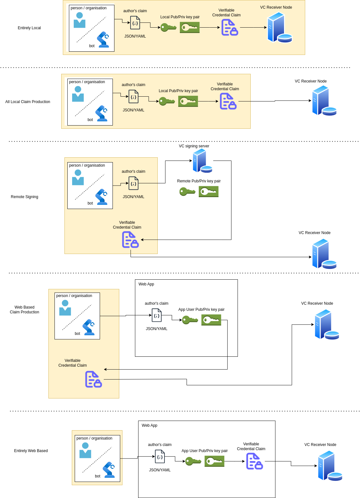
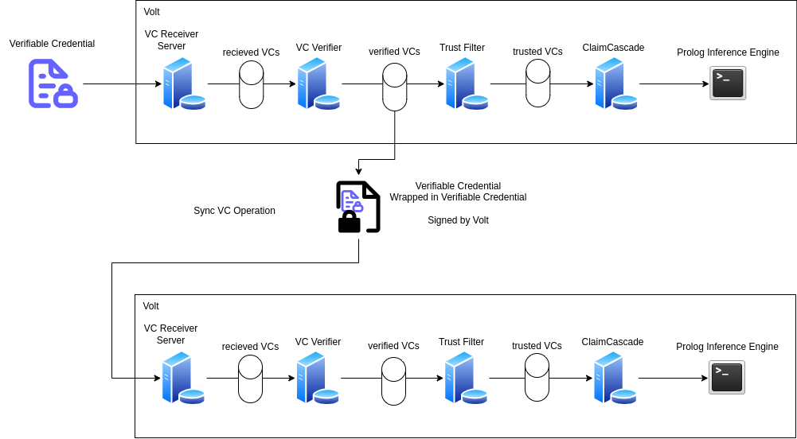
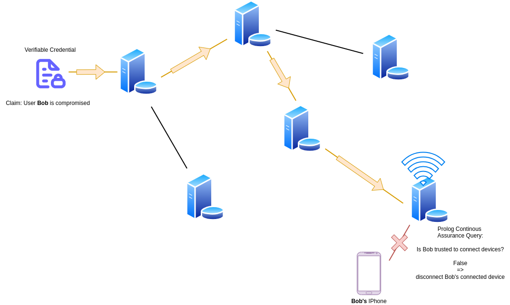

Every piece of information communicated to the system will be claimed in the form of a verifiable credential, and signed by the private key of the user making the claim (henceforth called the claim originator). Where this signing takes place is completely optional, for example below we've outlined several different schemes by which the VC may be produced, signed and send to a node set up to receive the VC, with differing levels of locality, from everything performed on a local machine, including a node on the local machine, to a user authoring and signing the claim entirely through a web interface.

The VC may be communicated to the a node of the system via a number of different routes, for the simplest example lets assume a REST API endpoint is present on the node which may receive VCs. The VC will be verified to check that it was signed by the private key of the user and that the information contained within has not been tampered with. Next the VC may optionally be propagated to other nodes on the system (encapsulated within a VC signed by the node which received the VC). The next step is that the VC is parsed by the trust engine to determine whether the VC is trusted to make inferences upon, this trust engine may be differently configured on different nodes of the system, if the trust engine determines that the VC is trusted it is passed to the next stage of the system. The next stage of the system parses the information in the verifiable credential and translates it into the appropriate Prolog representation, and updates the current Prolog inferencing environment of that node, such that the encapsulated information may be used to perform inferences.

In this way each node of the system can pass verified information to each other node of the system, and the route by which it got to that node of the network (the provenance of that claim) may be cryptographically attested to by the nesting of VCs.

