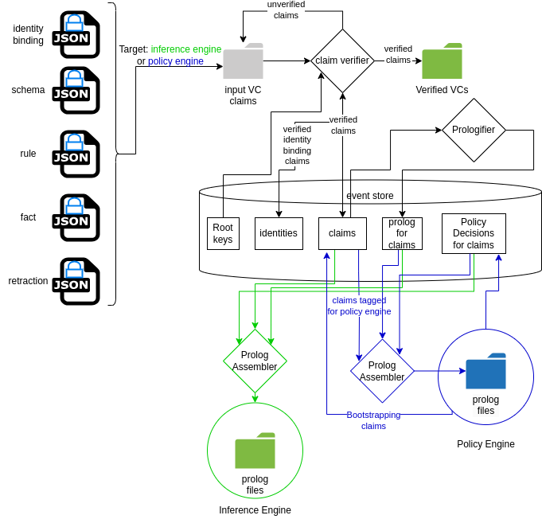

## VC Types

The VCs which may be submitted to the system come in 5 types:

- identity binding - this defines the binding between a public key (VC issuer) and a user's identity (for example for human users their email-address, or in the case of autonomous agents their unique identifier)
- schema - this defines the schema for a fact which may be submitted, for example, for a fact that a device has a vulnerability the schema defines how that fact is structured, i.e. what fields are associated with this fact and any constraints on the values which may be entered for each field. 
- fact - this defines a fact which should be added to the inferencing environment to be reasoned about, the fact structure should match a schema submitted to the system, for example a fact that a device has a vulnerability
- retraction - a statement that a user retracts a previously submitted claim
- rule - this defines a rule, which defines the logic used for inference, for example a rule may be that a device is not allowed to connect to this wifi router if it has a vulnerability with a score higher than a certain threshold. 

Using these building blocks one may build any general inferencing system.

## Signing of VCs

The claim cascade system is designed such that users or automated agents may sign claims with their private key (stored locally or stored on a remote server which for signs the claims on the user's behalf), the only requirement for the VC to be verifiable is that public key paired with the private key which was used to perform the signing will need to be securely shared in a trusted way with the system, such that the public key can be tied to a particular user's identity. 

This will be achieved by utilising an authentication server which can be sent a request to generate a VC binding a public key to a user's identity, this request will contain the public key and a users credentials, in the most simple case, an email address. These credentials will then be verified, for example in the case of email; the user will receive an email which contains a link they must click to prove their identity, once that is completed the authentication server will sign a VC with it's own private key, which is trusted bt the system, binding the user's identity to that public key. This can be submitted to the system by the user to allow them to submit further VCs signed with their private key.

## Receipt of VCs

VCs will be submitted to a particular Claim Cascade node (running on a router / access point for example) through a HTTPS REST API endpoint. The VC will is then stored in an append only store as a received VC on that node using an Event Sourcing pattern. This means that once received a record of all the VCs received will be maintained and if our trust basis or verification basis changes one could regenerate the entire state of the system from the received VCs.

## Verification of VCs

Once a new VC has been received it is stored on the node and the verifier process runs on it, which verifies that the VC was signed by the issuer (the VC issuer is specified in the VC) and has not been tampered with and that we have previously received an identity binding for this VC issuer which was itself signed by a trusted identity. Once a VC is verified it is entered into the append-only claims table of the eventstore, it may also at this stage be signed by the node's public key as a VC and communicated to other nodes on the system, so they can process the information claimed within.

## Prologification of Claims

Once the claim has been entered into the eventstore the prologifier process will run on that claim to translate the information in the claim into it's prolog representation and enter that representation in the eventstore.

## Policy Engine

Claims submitted may either target the inference engine, which provides the application-specific inferences, in this application the device-networking application, or they may target the policy engine, which is another prolog-implemented inference engine created using the exact same system, but this inference engine is used to determine if the claims submitted are permitted to be used in the target inference engine. 

I.e. the policy engine may permit a series of claims which target the policy engine itself, the policy engine itself will then be updated and rebuilt with these prologified claims adding to the policy engine itself, so it constantly rebuilds itself with new information. For example in the initial default bootstrapped state it has 2 groups that users can belong to, policy makers, and admins, and it adds some implicitly trusted admin accounts to these 2 groups. A user in the policy makers group can add claims which target the policy engine, and admins may add claims which target the inference engine.

A policy maker could then submit a series of claims to define a new group, fact submitters, and a rule saying fact submitters may submit facts which target the inference engine only, but not schemas, retractions or rules, and then add claims to add a number of user's email address identifiers to this fact submitters group. Users in that group could then submit facts to the inference engine, for example they could then use the UI to login to the CAHN app and submit information through the UI, such as binding devices to device types, or communicating they don't trust a device to onboard onto the network.

The policy engine however is a fully configurable inference engine itself, a policy maker could add a series of schemas to define new fact structures and a series of complex rules to determine if a user is able to submit claims, for example one could add a schema to define a users role in the organisation, the amount of start time at which they took on that role and write a rule that only users in this specific role for over a certain amount of time can add facts of this particular sub-set of fact types, and can only add facts from their start time to the time they leave that role, and only on weekdays between 9AM and 5PM. One could even integrate the policy engine with a rota or leave monitoring system, only allowing users to submit facts of the specified types during their working hours when they are not on leave. 

## Inference Engine

The claims which are permitted by the policy engine and have not been retracted are retrieved from the eventstore and their prolog representation is used to build the prolog inference engine which is used for the application logic, in the case of CAHN this application logic is [the use case policy dimensions](../20-uses-cases.md#uc-policy-dimensions-onboarding).

## Querying the system

Queries of an application specific prolog inference engine are made by producing a REST API to run alongside the inference engine which serves API routes which are configured to perform specific queries of the system. 

## Databots

In order to perform more complex or numerical analytics which cannot be simply performed with a prolog query, for example generating some computed analytical artifact by analysing the data about device behaviour the analytics will be performed by a process set up to run on configurable inputs by a configurable trigger, which we call a databot. Upon a trigger condition being met, the databot will retrieve any inputs which need to be configured at run-time and the process will run for those inputs and, once it's computation is complete, send its output data into the system by means of a VC signed by the databot agent. These triggers can be triggered at query time if the information for a query result is not already present in the system, or is in need of update.

## System Diagram

Below is a diagram showing and flow of information in the core claim cascade implementation. An instance of claim cascade will be installed on a node of the system, inside a router or network element. The databots may be installed locally on the node, or run on a remote server. The authentication server, likewise could sit locally on the node, or run on a remote server. 

Any process or app which wants to submit VCs to the system must generate a key pair and have it's public key bound to an identity which is verified through the authentication server. The process may submit VCs signed with it's private key at any time and once the identity-public key has been bound with an identity claim, those VCs which have been submitted, or will be submitted, will be verified as being issued by their issuer and may proceed to be entered into the eventstore for the prolog translation to occur and the policy engine to make a decision as to whether to permit this claim into it's target engine at the current time.

