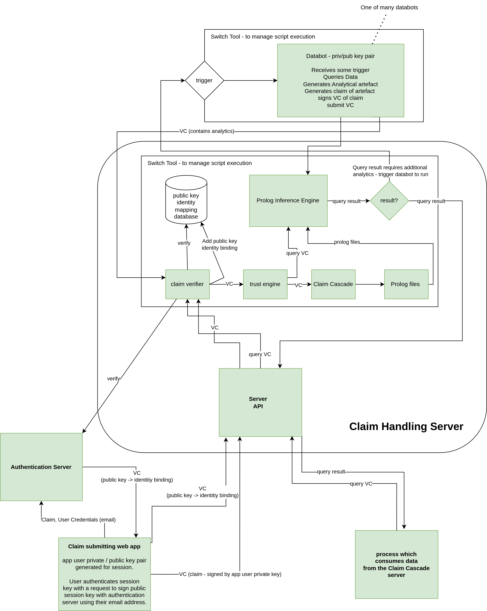

## Signing of VCs

The claim cascade system is designed such that users or automated agents may sign claims with their private key (stored locally or stored on a remote server which for signs the claims on the user's behalf), the only requirement for the VC to be verifiable is that public key paired with the private key which was used to perform the signing will need to be securely shared in a trusted way with the system, such that the public key can be tied to a particular user's identity. 

This will be achieved by utilising an authentication server which can be sent a request to generate a VC binding a public key to a user's identity, this request will contain the public key and a users credentials, in the most simple case, an email address. These credentials will then be verified, for example in the case of email; the user will receive an email which contains a link they must click to prove their identity, once that is completed the authentication server will sign a VC with it's own private key, which is trusted bt the system, binding the user's identity to that public key. This can be submitted to the system by the user to allow them to submit further VCs signed with their private key.

## Receipt of VCs

VCs will be submitted to a particular Claim Cascade node (running on a router / access point for example) through a HTTPS REST API endpoint. The VC will then be stored in an append only return as a received VC on that node using an Event Sourcing pattern. This means that once received a record of all the VCs received will be maintained and if our trust basis or verification basis changes one could regenerate the entire state of the system from the received VCs.

## Verification of VCs

Once a new VC has been received it will be stored on the node and a verifier process will start, which runs on that VC to verify that the VC was signed by the issuer (the VC issuer is specified in the VC) and has not been tampered with, this requires the verifier to have access to the public key of the issuer, which requires it to have been communicated through a trusted method to the node, or for the node to have access to, and trust, a server which has a record of the pubic key of the issuer. Once a VC is verified it may be passed onto the next stage of the process, which is the trust engine, it may also at this stage be signed by the node's public key as a VC and communicated to other nodes on the system, so they can process the information claimed within. 

## Trust Engine

The verification step above merely checks that the VC was signed by the issuer contained within and that it has not been altered since signing, it doesn't say anything about whether the issuer of that VC is trusted to be making claims to this node. The trust engine's purpose is to resolve whether we should trust the information contained within the VC and use the information contained within to perform inference. The details of the algorithm to use to determine if we trust the VC issuer is still in development and discussion but the idea is to use the following information to infer whether the issuer is to be trusted:
- which other users trust or distrust the issuer, and the trust we have in those users
- which claims this issuer has submitted in the past

## Trusted VC to Inference Environment

The VCs which are trusted are then passed to a utility which generates the code in Prolog for the information contained within the VC. The VCs which may be submitted here come in 4 types:

- schema - this defines the schema for a fact which may be submitted, for example, for a fact that a device has a vulnerability the schema defines how that fact is structured, i.e. what fields are associated with this fact and any constraints on the values which may be entered for each field. 
- fact - this defines a fact which should be added to the inferencing environment to be reasoned about, the fact structure should match a schema submitted to the system, for example a fact that a device has a vulnerability
- retraction - a statement that a user retracts a previously submitted fact, used to retract falsely submitted information
- rule - this defines a rule, which defines the logic used for inference, for example a rule may be that a device is not allowed to connect to this wifi router if it has a vulnerability with a score higher than a certain threshold. 

Using these building blocks one may build any general inferencing system.

## Querying the system

When an external process needs to query the system, this query will take the form of a VC, the verification step will check the query is from the the VC issuer, and the trust engine will check that the VC issuer has the rights to perform that query and access the data required to fulfil the query.

## Databots

In order to perform more complex or numerical analytics which cannot be simply performed with a prolog query, for example generating some computed analytical artifact by analysing the data about device behaviour the analytics will be performed by a process set up to run on configurable inputs by a configurable trigger, which we call a databot. Upon a trigger being triggered, the trigger will receive any inputs which need to be configured at run-time and the process will run for those inputs, retrieve any data required for the analytics from the system by means of a query VC submitted to the system, and once it's computation is complete, send its output data into the system by means of a VC. These triggers can be triggered at query time if the information for a query result is not already present in the system, or is in need of update.

## System Diagram

Below is a diagram showing the components of the system. The components in the Claim Handling System box will be installed on a node of the system, inside a router or network element. The databots may be installed locally on the node, or run on a remote server. The authentication server, likewise could sit locally on the node, or run on a remote server. 

Any process or app which wants to submit VCs to the system must generate a key pair and have it's public key bound to an identity which is verified through the authentication server. The process may submit VCs signed with it's private key and once the public key has been bound, those VC which have been submitted, or will be submitted, will be verified as being issued by their issuer and may proceed to be entered into the knowledge base held in the inference engine, depending on if the issuer is trusted by the trust engine or not.

