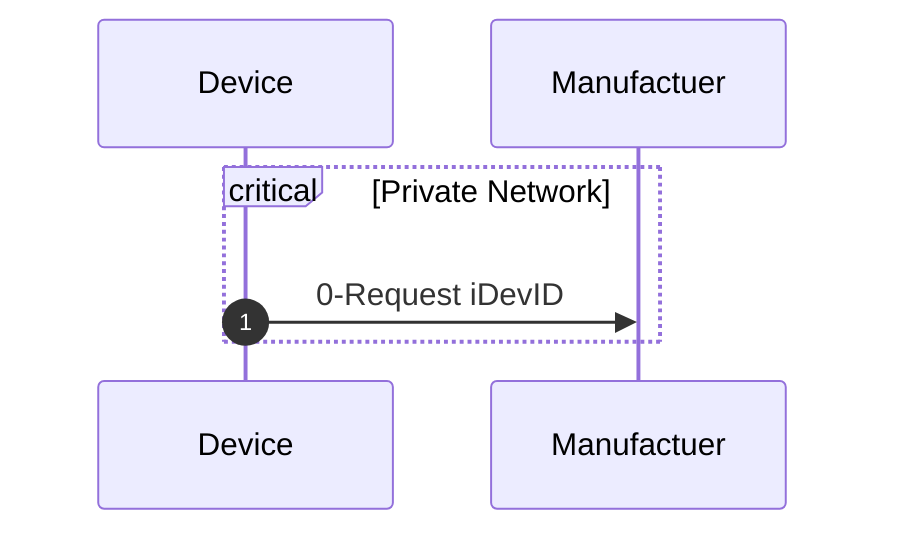
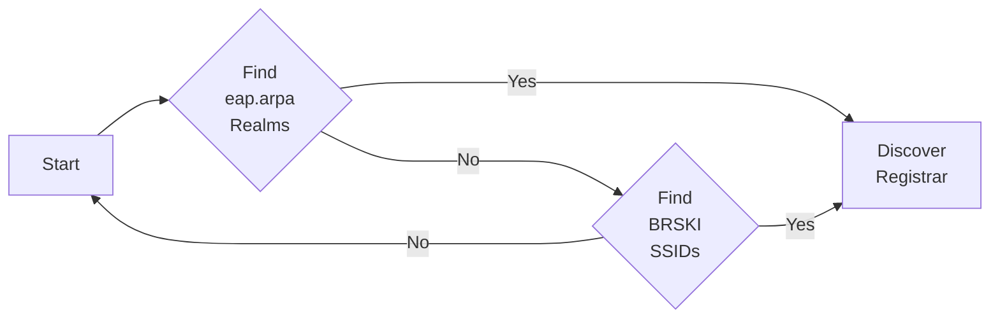
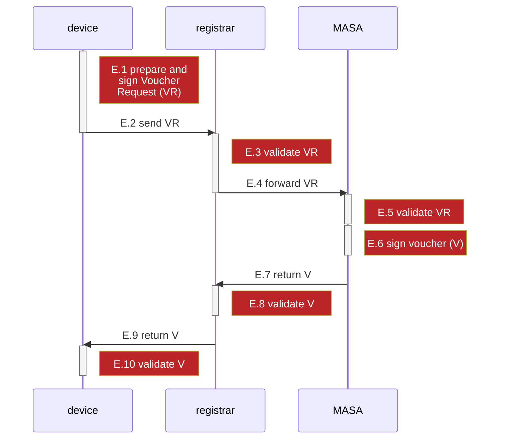
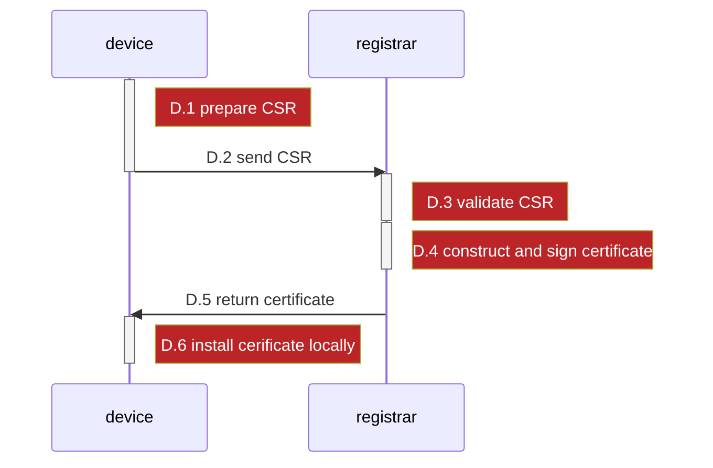
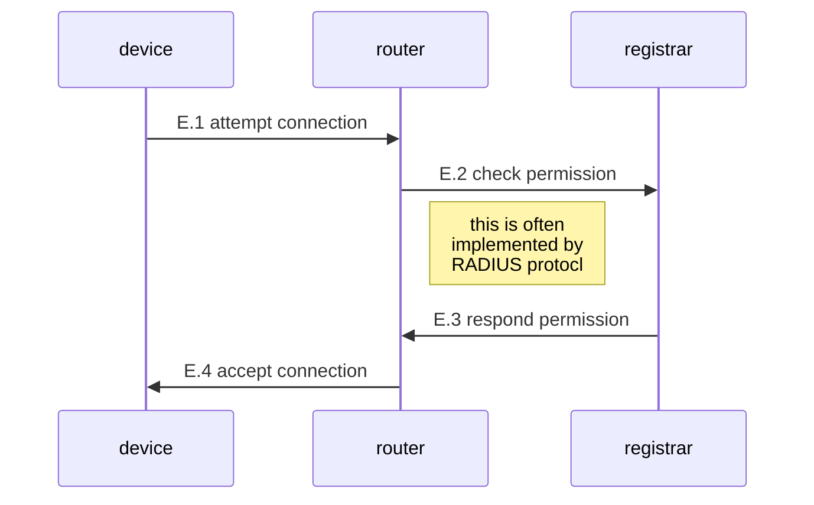
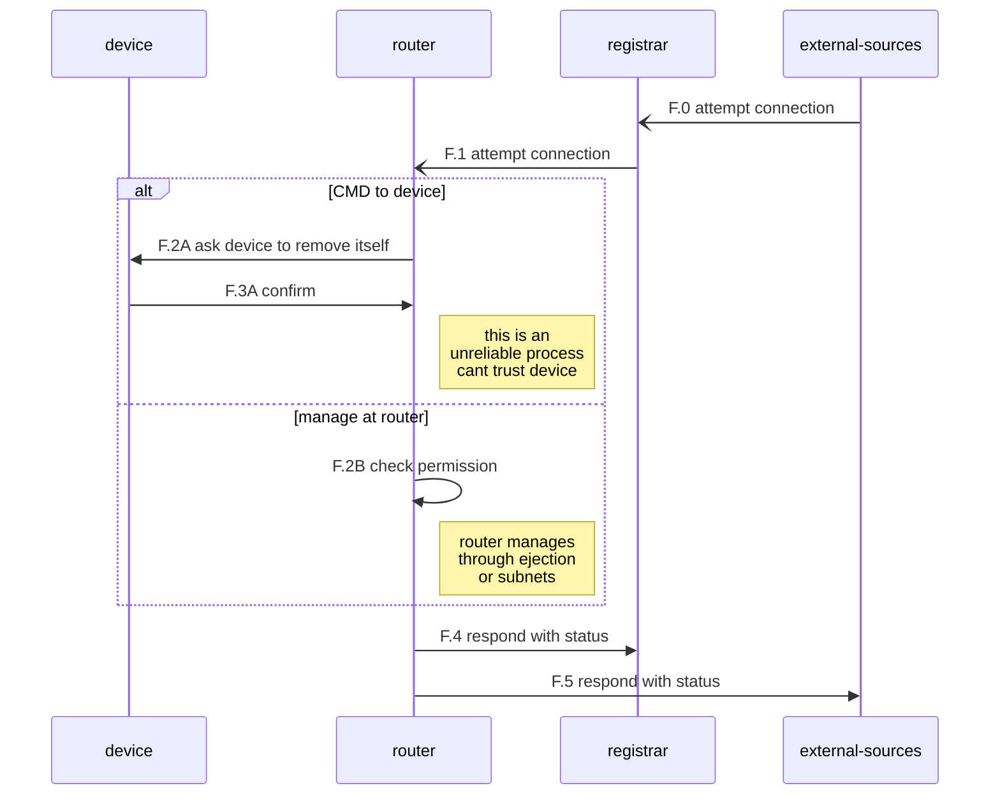

---

title: BRKSI Protocol Overview
---

# Terminology

We will use the term `device` interchangeably with the term `pledge` for easier reading

* `device`: the device wishing to onboard to the network 

* `registrar`: the principle decision making entity on the on boarding process

* `proxy`: a proxy to the registrar - useful if the registrar is located externally of shared between networks 

* `MASA`: the manufacturer authority, which issues manufacturer assurances (like iDevID) and can attest to the validity of these assurances

* `router`:  the physical router to which a device is connecting, the router will potentially host many networks

* `onboarding network`: a constrained network which is used to bootstrap the onboarding process

* `target network`: the operational network to which the device is intending to attach to 

* `iDevID`: a unique device certificate, issued by the manufacture

* `LDevID`: a certificate used by the device to get network accesss (EAP certificate)

  

# Stages Overview

- O - Factory provisioning 
- A - Discover onboarding network 
- B - Discover registrar
- C - Request voucher
- D - Enrol the device
- E - Join the network
- F - Continuous assurance of the network 

# 0 - Factory Provisioning

The demonstrated factory provisioning flow is as follows

* 0.1 - Device is pre-provisioned with the manufactures' CA and URI for manufactures' servers
* 0.2 - Device generates a unique public/private key pair
* 0.3 - Device requests an iDevID from the manufacturer
* 0.4 - Returned iDevID is installed on the device

# A - Onboarding discovery

There are two methods for discovering potential on boarding networks:

- A.1 - Search for public WIFIs matching a particular SSID wildcard name
- A.2 - Search for WIFIs advertising a particular realm

## A.1 BRSKI%ssidname wildcard match

The device will search for all SSIDs matching the wildcard as specified in [^FRIEL]

The device will iterate round robin across successful pattern matches in strength order. 

Every time an device finds a viable match it will connect to the onboarding network and attempt to discover the registrar.

## A.2 802.11u eap.arpa

The device will search for all networks supporting the `eap.arpa` realm

The device will iterate round robin across successful pattern matches in strength order.

Every time an device finds a viable match it will connect to the onboarding network and attempt to discover the registrar.

## Onboarding process

The device will prefer onboarding networks with realm support over BRSKI SSID match. 

# B - Discover Registrar

When the device has a discovered a candidate onboarding network it will attempt to discover the registrar.

If the registrar is non discoverable, this onboarding network will be temporarily marked as failed, and the onboarding process will proceed to the next  candidate onboarding network.

The device operates either in IPV6 or IPV4 mode. The options for Registrar discovery are slightly different in each case. 

For the purposes of the NIST Build 5 demonstrator we shall use the mDNS method of directly discovering the registrar as outlined in Appendix A [^rfc8995]

> Discovery of the registrar **MAY** also be performed with DNS-based Service Discovery by searching for the service "_brski-registrar._tcp.example.com". In this case, the domain "example.com" is discovered as described in [[RFC6763](https://www.rfc-editor.org/rfc/rfc8995.html#RFC6763)], [Section 11](https://www.rfc-editor.org/rfc/rfc6763#section-11) ([Appendix A.2](https://www.rfc-editor.org/rfc/rfc8995.html#IPv4dhcp) of this document suggests the use of DHCP parameters).

Specifically:

* Device obtains an IP address via DHCP as per A.2  [^rfc8995]
* Device listens for service announcement `"_brski-registrar._tcp.example.com"` as per  Appendix B [^rfc8995]
* Device secures IP address of candidate Registrar
* Device attempts to initiate voucher request

## Discover Registrar (full options)

TBD: outline the full list of methods for discovering registrar 

# C - Request Voucher Registrar

**Preconditions:** before we initiate the Request Voucher we assume the following conditions are met.

* `device` is provisioned with a valid `iDevID`

* `device` has connected to a candidate `onboarding network`

* `device` has a valid IP address on the  `onboarding network`

* `device` has discovered the IP address of a candidate `registrar` (or a `proxy`)

  

**Post conditions (success):** if the voucher request is successful IF

* `device` is in posession of a valid `voucher` 

* where the voucher tests that need to pass are

  * x

  * y

  * z

## C - Request Voucher overview (basic)

The complete flow of the voucher request process is as follows 

- C.1 `device` constructs `voucher request` construct request and sign it with `iDevID` private key
- C.2 `device` sends `voucher request` to `registrar` 
- C.3 `registrar` validates `voucher request` 
- C.4 `registrar` forwards `voucher request` to `MASA` 
- C.5 `MASA` validates `voucher request`
- C.6 `MASA` signs `voucher`
- C.7 `MASA` returns `voucher` to `registrar`
- C.8 `registrar` validates `voucher`
- C.9 `registrar` returns voucher to `device`
- C.10. `device` validates `voucher`

## 3 - Request Voucher overview (advanced policy )

Validation processes exist at statges

- C.1
- C.3
- C.5
- C.8
- C.10

At each of these stages there is the option to evaluate and enforce a policy decision

C.3 andC.8 are validation and policy enforcement points implemented at the registrar and therefore ideal for implementing the core networking policy 

# D Enrol the device

Enrolling the device is relatively simple, consisting of the following steps

- D.1 - device constructs the CSR request for enrolment, which includes the iDeviD
- D.2 - device sends the CSR to the registrar (over the authenticated TLS session)
- D.3 - the registrar validates the CSR request
- D.4 - the registrar constructs the certificate response (LDevID)
- D.5 - the registrar returns the certificate to the device
- D.6 - the device saves the LDevID (network credentials) locally ready to attach to the network 

# E Join the network

Joining the network can be triggered by the device as soon as the the device is in posssions of a a valid LDevID (or other network credential)

The router will receive the network connection request. It may confer with the registrar, to check that the device is adequately permissioned to join the network. Typically this maybe be performed through the RADIUS interface. 

# F Continuous assurance of the network

For the full detail of the continuous assurance process, see reference document [Continuous Assurance](22-certificates.md)

# Appendix: key references

[^rfc8995]: https://datatracker.ietf.org/doc/rfc8995/
[^FRIEL]: https://ftp.kaist.ac.kr/ietf/draft-friel-brski-over-802dot11-00.txt

[^EMU]: https://datatracker.ietf.org/doc/draft-richardson-emu-eap-onboarding/