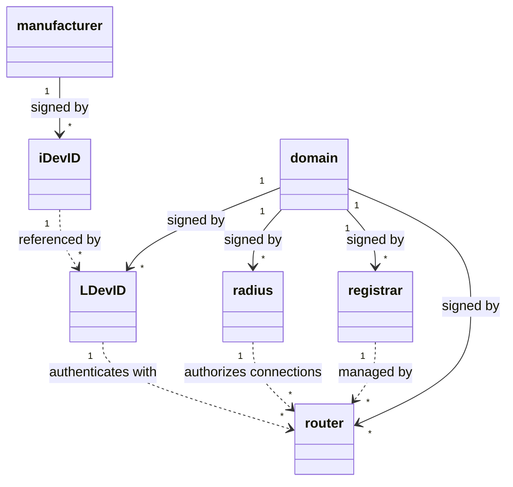

# Certificate Lifecycle

Certificates are used throughout the BRSKI-WIFI onboarding process. 

It is helpful to clearly distinguish how these are used in a practical implementation and outline how they are structured

## Cert relationships

* `iDevID`: is the unique identifier for the device, and is typically only created once  
* `LDevID`: are created when a device is onboarded and represents the evidence that the device has joined the logical domain 
* `domain`: is the logical domain to which the device is onboarded, and implicitly to which the network also belongs
* `registrar`: is the intermediate mechanism by which a device joins a logical domain. 
* `radius`: is not mentioned directly by the BRSKI specification, but is used in the implementation. Logically  the radius and the registrar are in a 1:1 relationship
* `manufacturer`: the originating manufacture of the device  
* `router`: each router must have an end point certificate, 

## iDevID

The iDevID sits on the device (pledge).

It is typically created as a one off process. It should not change during the devices lifecycle

It typically is installed by the manufacture as a privileged process. 

The method of installing a manufacturer created iDevID is covered in depth in the factory use case. The basic flow however is as follows.

**Creation**

1. [@ DEVICE] create a public private key pair
2. [@ DEVICE] create a CSR
3. [TO MANUFACTURER] send CSR
4. [@ MANUFACTURER] validate CSR
5. [@ MANUFACTURER] create and sign certificate with manufacture key 
6. [TO DEVICE] return signed iDevID certificate
7. [@ DEVICE] locally install iDevID certificate 

| X509 Attribute             | Description/use                                              |
| -------------------------- | ------------------------------------------------------------ |
| `Subject`                  | Name of device (optional) CN="serial number" OU="model name" |
| `Subject Key Identifier`   | Public key of the `device+`                                  |
| `Issuer`                   | Name of the manufacture  CN="Manufacturer ltd" OU="www.manufacture.com" |
| `Authority Key Identifier` | Public key of the `manufacturer+`                            |
| (signed by)                | Private key of the `manufacturer-`                           |

## Domain

The domain represents the root logical ownership of the ***network*** it is broadest sense. It is therefore an organisational perimeter, which can own network routing devices and onboarded devices. 

The root domain CA is typically a self signed certificate 

Practically for the purposes of the demo, the domain is collocated with the registrar

 **Creation**

1. [@ DOMAIN] create a public private key pair
2. [@ DOMAIN] self sign with domain private key 

| X509 Attribute             | Description/use                                              |
| -------------------------- | ------------------------------------------------------------ |
| `Subject`                  | Name of the owner  CN="name of owner" OU="www.manufacture.com" OR email@address |
| `Subject Key Identifier`   | Public key of the `domain+`                                  |
| `Issuer`                   | Name of the manufacture  CN="name of owner" OU="www.manufacture.com" OR email@address |
| `Authority Key Identifier` | Public key of the `domain+`                                  |
| (signed by)                | Private key of the `domain-`                                 |

## Registrar

According to the specification, the registrar 

> is element of the network domain that it will belong to and that will perform its bootstrap

It is best to conceive of it as the part of the network (domain) which provides a method  the device of logically joining the network (domain)

The `registrar` is signed by the `domain`

 **Creation**
Practically, for this build, the domain and registrar are co-located, so the creation process can be simplified.
1. [@ REGISTRAR] create a public private key pair
2. [@ REGISTRAR] create CSR
3. [@ DOMAIN] sign CSR with domain private key and create registrar X509
In a real deployment, where the registrar and domain are not in a 1:1 relationship, we need to consider how the registrars certificates are deployed.

This could end up looking very like the BRSKI provisioning process

The process should be in infrequent setup process

| X509 Attribute             | Description/use                |
| -------------------------- | ------------------------------ |
| `Subject`                  | C = IE, CN = registrar-tls-meta |
| `Subject Key Identifier`   | Public key of the `registrar+` |
| `Issuer`                   | C = IE, CN = registrar-tls-ca |
| `Authority Key Identifier` | Public key of the `domain+`    |
| (signed by)                | Private key of the `domain-`   |   |

## Radius

The radius server is an implementation detail of the router.

It is not needed or referenced in the  BRSKI definition; it is useful in a practical implementation.

Many routers, use a RADIUS server to abstract the authentication process  

Specially the implementation of EAP-TLS on HostAPD in the Raspberry Pi  (See implementation notes )

 **Creation**

The creation process for the RADIUS certificate is identical to the creation process for the registrar. It just refers to a different subject (the radius public key)

| X509 Attribute             | Description/use              |
| -------------------------- | ---------------------------- |
| `Subject`                  | C = IE, CN = registrar-tls-ca |
| `Subject Key Identifier`   | Public key of the `radius+`  |
| `Issuer`                   | C = IE, CN = registrar-tls-ca |
| `Authority Key Identifier` | Public key of the `domain+`  |
| (signed by)                | Private key of the `domain-` |

### Use of Radius certificate

The radius certificate is used to setup EAP on the hostapd (the router)

In operational mode hostapd will accept a presented EAP certificate (LDevID), if it signed by the same root (the domain), as long as that LDevID has not been revoked.

## Router

The router certificate not needed or referenced in the baseline BRSKI definition. It is used in Build 5, to secure the connection between the router and the registrar. Specifically it is used to implement the continuous assurance command server. 

Many routers can be connected to a single registrar.

 **Creation**

For the purposes of the Build 5 demonstrator, we assume the router certificate to have been created and provisioned before time. 

Interestingly however, a router joining a network, is not dissimilar to an IOT device joining a network.

 It just happens that after joining, the router (over and above a normal IOT device), can physically extend or bridge the network.

A later demonstrator should show how live router provisioning can be performed using  BRSKI provisioning 

Essentially its just an iDevID

| X509 Attribute             | Description/use                                              |
| -------------------------- | ------------------------------------------------------------ |
| `Subject`                  | Name of router(optional) CN="serial number" OU="model name" |
| `Subject Key Identifier`   | Public key of the `router+`                                  |
| `Issuer`                   | Name of the manufacture  CN="Manufacturer ltd" OU="www.manufacture.com" |
| `Authority Key Identifier` | Public key of the `manufacturer+`                            |
| (signed by)                | Private key of the `manufacturer-`                           |

### Use of router certificate

The router certificate us used to authorise the connection between the router and the registrar.

If the router and registrar are signed by the same domain, then the connection is deemed authorised. 

## LDevID

The LDevID is created when a device is successfully enrolled

It is used as a cryptographic artefact to prove that the device (iDevID logically belongs to the domain ) 

If the device can prove it belongs to the domain this is one of the primary dimensions of authorisation, to allow a device physical operational access to the  network 

 **Creation**

The LDevID creation process is formally defined in the BRSKI specification and is summarised in protocol overview section 4.

There are a few specific additions needed to get EAP working 

Simplified 

1. [@ DEVICE] creates mutually authenticated TLS with registrar using iDevID

2. [ -> REGISTRAR] send the enrol command (optimally repeating iDevID)

3. [@ REGISTRAR] extracts iDevID (from TLS session or enrol command) and constructs a signing request for LDevID

4. [@ REGISTRAR] add the SSID identifier to the CSR

5. [@ REGISTRAR] signs the LDevID with the registrar- private key (where in turn the registrar has been signed with the domain-)

6. [-> DEVICE] send certificate back to device 

7. [@ DEVICE] install LDevID

| X509 Attribute             | Description/use                                              |
| -------------------------- | ------------------------------------------------------------ |
| `Subject`                  | Name of connection (optional) CN="SSID of network" OU="model name" |
| `Subject Key Identifier`   | Public key of the `iDevID+`                                  |
| `Issuer`                   | Name of the registrar??                                 |
| `Authority Key Identifier` | Public key of the `registrar+`                               |
| (signed by)                | Private key of the `registrar-`                              |
### Use of LDevID certificate
LDevID is created in the EST enrol stage of the BRSKI flow
LDevID is signed by registrar

LDeviD is presented by the device as its EAP-TLS certificate when attempting to connect to the operational network.