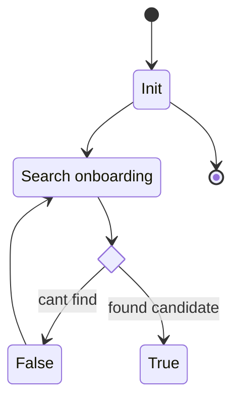

# State machine analysis

This document examines the state machine of each of the primary moving parts

```mermaid
stateDiagram
   direction TB

   accTitle: This is the accessible title
   accDescr: This is an accessible description

   classDef notMoving fill:white
   classDef movement font-style:italic
   classDef connected fill:#f00,color:white,font-weight:bold,stroke-width:2px,stroke:black

  OBS: Search onboarding
   state fn <<choice>>
	
   [*]--> Init
   Init --> [*]
   Init --> OBS
   OBS --> fn
   fn --> False: cant find
   fn --> True : found candidate
   False --> OBS	  
   
   

   class Still notMoving
   class Moving, Crash movement
   class Connected connected
   class end connected
```

