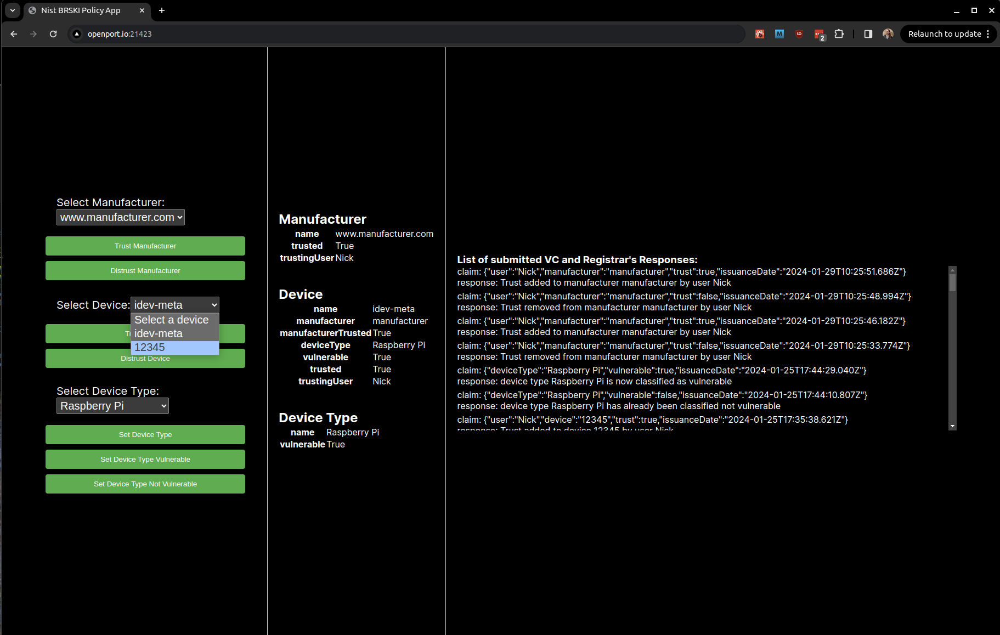

To demonstrate the system, there are two applications: one controls the pledge device, and the other allows you to submit information to the registrar and view the state of the registrar.

## Build 5 Web Application - Pledge

The Pledge application can be accessed remotely at [https://openport.io/l/36701/Hml13gRqlf8l8006](https://openport.io/l/36701/Hml13gRqlf8l8006) or locally at [http://pledge.local:8082/](http://pledge.local:8082/).

### Usage

#### Onboarding Process:

#### Onboard Button

Initiates the onboarding process for an IoT device, connecting it to a secure network.
**Start Onboarding:** The application begins the onboarding process.

**Disconnects from Wi-Fi:** If the device is currently connected to any Wi-Fi network, it attempts to disconnect.

If the device is not active on a network, it may show an error but will proceed with the process.

**Connects to brski-open Network:** The device connects to an open Wi-Fi network named brski-open to discover the registrar.

**Finds Registrar:** The app looks for the registrar's IP address and port.

**Runs BRSKI Commands:** It executes the BRSKI (Bootstrapping Remote Secure Key Infrastructures) process, which includes:

*Sending a voucher* request to the registrar.
*Signing certificates* with the registrar's information.
*Receives Certificates:* The app retrieves signed certificates necessary for secure communication.

**Disconnects from brski-open:** After obtaining the certificates, the device disconnects from the brski-open network.

**Connects to registrar-tls-ca Network:** It connects to a secure network named registrar-tls-ca, which uses the obtained certificates for secure EAP-TLS authentication.

**Completes Onboarding:** The onboarding process is completed, and the device is now securely connected to the registrar-tls-ca network.

**Onboard Button:** Initiates the onboarding process for an IoT device, connecting it to a secure network.

- **Start Onboarding:** The application begins the onboarding process.
- **Disconnects from Wi-Fi:** Attempts to disconnect the device from any current Wi-Fi network.
- **Connects to brski-open Network:** Connects the device to an open Wi-Fi network named brski-open to discover the registrar.
- **Finds Registrar:** Searches for the registrar's IP address and port.
- **Runs BRSKI Commands:** Executes the BRSKI (Bootstrapping Remote Secure Key Infrastructures) process, which includes:
  - *Sending a voucher* request to the registrar.
  - *Signing certificates* with the registrar's information.
  - *Receives Certificates:* The app retrieves signed certificates necessary for secure communication.
- **Disconnects from brski-open:** After obtaining the certificates, the device disconnects from the brski-open network.
- **Connects to registrar-tls-ca Network:** Connects to a secure network named registrar-tls-ca, using the obtained certificates for secure EAP-TLS authentication.
- **Completes Onboarding:** The onboarding process is completed, and the device is securely connected to the registrar-tls-ca network.

#### Offboarding Process:


**Offboard Button:** Removes the IoT device from the secure network and deletes its network profile.

- **Begins Offboarding:** Starts the offboarding process for the IoT device.
- **Disconnects from Network:** Disconnects the device from the current network (registrar-tls-ca).
- **Removes Connection Profile:** Deletes the network connection profile for registrar-tls-ca from the device, preventing it from automatically connecting to this network.
- **Completes Offboarding:** The device is offboarded, and the secure connection profile is successfully removed.

## Build 5 Registrar Web Application

The Registrar Demo App is a web-based user interface running on the access point, allowing you to send, sign, and view verifiable credential claims as if you were a network owner.

On the supplied devices, the app can be accessed remotely at [https://openport.io/l/21423/5FbFMfRa0Nx9RG0i](https://openport.io/l/21423/5FbFMfRa0Nx9RG0i) or locally at [http://registrar.local:3002/](http://registrar.local:3002/).


The app is divided into three panels:

1. The left panel enables you to select a manufacturer, a device, and a device type from the registrar's database.
2. The middle panel displays information from the selected entities in the database.
3. The right panel shows all verifiable credential (VC) claims submitted to the registrar and the corresponding responses.

When a device attempts to onboard the access point, the policy is checked on the registrar using Rust library functions. These methods check three queries:

1. Whether the device manufacturer (the issuer of the device's iDevID) has been trusted by the network owner or someone with permissions to trust manufacturers.
2. Whether the device is trusted by someone with permissions to permit device connections.
3. Whether the device type bound to the device has any vulnerabilities above the set threshold. For the demo policy, any device type with High or Critical severity vulnerabilities above the threshold is considered vulnerable.

If the manufacturer is not found in the database, it is added, and its trust status is set to untrusted. Similarly, if the device is not found by the method used to check its trust, it is also added to the database, and an entry binding it to its manufacturer is inserted. If the device has not been bound to a device type, which must currently be done by a sufficiently permissioned user through the UI, then the vulnerability check assumes the device is vulnerable.

To select the device of interest, use the **Select Device** selection box. For the demo system, the device is labelled as "12345," which is the serial number of the device.



The current state of the selected device is displayed on the right. It includes information such as the device's name (12345), manufacturer (manufacturer), trust status, device type (Raspberry Pi), vulnerability status, and trust status.


To allow the device onto the network, it must display the following boolean values:

```bash
manufacturerTrusted: True
vulnerable: False
trusted: True
```

If any of these values are in the opposite boolean state, the device will be disconnected from the network at the next policy evaluation, which occurs once a minute.

When a new device onboards onto the router, the policy enforcement software runs on the router and contacts the registrar to test the policy using the iDevID. This action adds entries for the manufacturer (the iDevID issuer) and the device into the registrar's database, and the device is bound to that manufacturer. Initially, both entries are set to untrusted.

Using this demo app, a human agent assumes the role of the network owner and may grant or revoke trust to a manufacturer or device. They may also bind the device to a device type in the registrar's database by selecting the device type and clicking the **Set Device Type** button, which ties a device to a device type. This binding is necessary for a device to be permitted to stay connected to the network, as it is used to determine the device's vulnerability status.

