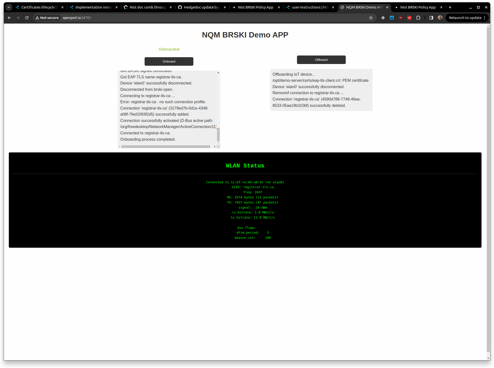
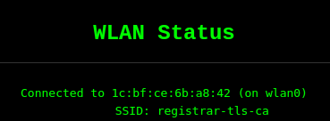
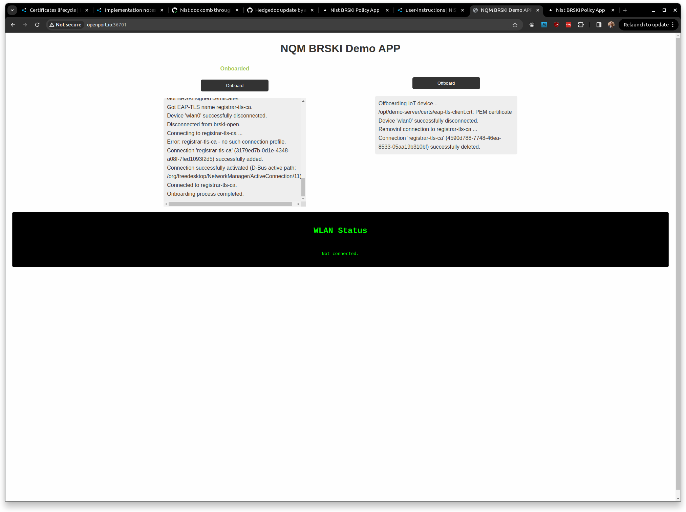
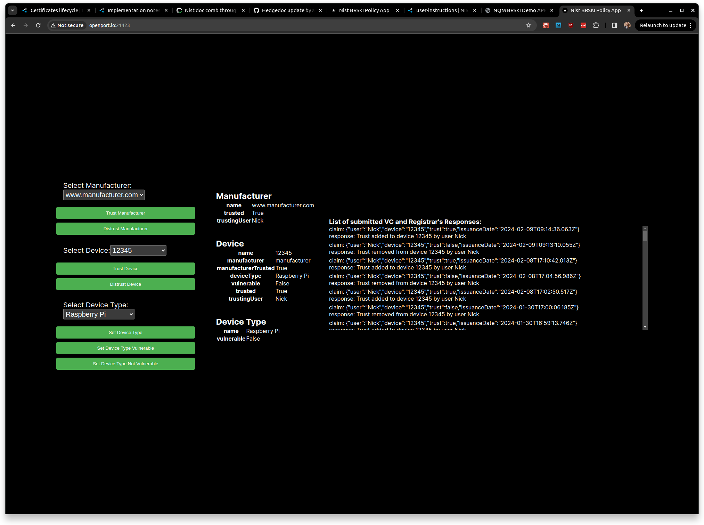

# Demo Continuous Assurance Workflow
These are the instructions of how to use the web applications to demonstrate the onboarding / offboarding and continuous assurance workflow.

## Check Pledge Allowed to Connect
To demonstrate the workflow, first check that the pledge device is trusted by the registrar, if we take a look at the registrar web application and select the device `12345`:


We should focus on the state of the device, it should look like so:


This means the device is allowed onto the network, as it's manufacturer is trusted, it is trusted and it is not vulnerable.


## Onboard pledge
If we then access the pledge web application and click the **Offboard** button to offboard it if `WLAN Status` displays it is already connected to `SSID: registrar-tls-ca`.

Then we can click the **Onboard** button to onboard the pledge through the BRSKI flow to the secure network. We should now see the device is connected like so:



Notice the final lines under the onboarded button:

```bash
Connected to registrar-tls-ca.
Onboarding process completed.
```

As well as:



## Distrust Pledge
If we now press the **Distrust Device** button in the registrar application to remove our trust in the pledge device we should see the registrar web application look like so: 


I've highlighted the changes with red boxes, we can see in the rightmost red box that a VC was submitted which sets the trust in device `12345` by `Nick` to false, and we can see the registrar responded to that VC with `Trust removed from device 12345 by user Nick`. In the leftmost box, the device details, we can see the device is no longer trusted.

## Registrar revokes LdevID

After a delay of up to a minute the registrar will re-check the policy and find that the device is no longer trusted, it will then revoke the LdevID associated with the device which will cause the pledge device to be kicked from the secure network, this will be visible on the pledge web application like so:



With the `WLAN Status` changing to `Not Connected`.

## Restore trust
If we now click the **trust device** button again this will restore trust in the pledge device, we can see the device information now lists it as trusted, and a VC has been submitted and accepted adding trust to device `12345` by user `Nick`.



## Onboard Pledge
We can now successfully onboard the pledge again as we did initially.

