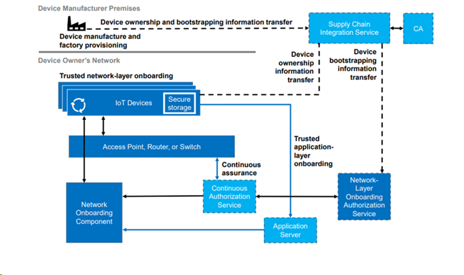

# Continuous Assurance

The continuous assurance process is the mechanism by which the `network` continuously monitors the security posture of the connected `device` and responds appropriately.

## CA Command Protocol

Within the BRSKI architecture, evaluation of network policy happens at the `registrar`.

A many-to-one relationship exists between the `router` and the `registrar`. This connection is initiated by the router, which finds the registrar using the same mechanism the device uses (GRASP or mDNS). The connection is a simple bi-directional TLS session.

### CA Protocol Authentication

The authentication method between the router and registrar is intentionally undefined. This is an implementation detail of the setup. For the purposes of this demonstrator, we shall use the notion of "common ownership." The steps for this are:

1. A one-off event: `registrar` generates a public/private key and self-signs a certificate.
2. A one-off event: `router` generates a public-private key pair and self-signs a certificate.
3. A one-off event: a VC is generated to the effect that person@email.com trusts the `registrar` (public key thereof). VC is signed by the private key of the person's DID: **Trust**(person@email.com,`registrar`+) : `person-`.
4. A one-off event: a VC is generated to the effect that person@email.com trusts the `router` (public key thereof). VC is signed by the private key of the person's DID **Trust**(person@email.com,`router`+) : `person-`.
5. The router attempts to connect to the registrar using mutually authenticated TLS. The router passes the router-signed VC as the initiation parameter. The connection is ACCEPTED IF the same person is the signatory, the same person is in both VCs, and the router and registrar public keys match the certificate evidence presented in the mutually authenticated TLS.

## Continuous Assurance Commands

There are two primary commands that the `router` must be able to process from the `registrar`:

- Trust device
- Revoke trust on device

We trust the device by sending the following VC on the CA protocol:

- **Trust**(`device+`,`registrar`+) : `registrar-`

We revoke trust by sending the following VC:

- **Revoke**(`device+`,`registrar`+) : `registrar-`

When we revoke trust on the device, we have a number of options:

1. Remove iDevID and LDevID pair from the registrar and reboot wifi
2. Change the VLAN allocation of the device to a constrained network

In this demonstrator, we shall use version 1; specifically, we shall remove the iDevID/LDevID from the permitted list of devices. At an implementation level, this means removing the record from the RADIUS server.

## Continuous Assurance Use Cases

The following lists out the different continuous assurance use cases we want to implement and defines the method by which it is implemented.

### Network Owner Trusts Manufacturer

The owner of the network specifically trusts the manufacturer.

The following VC is inserted into the registrar:

- **Trust**(person@email.com,`manufacturer`+) : `person-`

Note: If the network owner does not trust the manufacturer, the registrar should NOT forward the voucher request to the manufacturer. This would create information leakage.

### Network Owner Trusts Device

The owner of the network specifically trusts the device being onboarded.

The following VC is inserted into the registrar:

- **Trust**(person@email.com,`device`+) : `person-`

### Device Has Been Purchased

The device has been purchased by the person.

In the simple case, the manufacturer (MASA) records the purchase.

If the device is owned by the user, then we can infer the user trusts the device.

- **Purchase**(`device+`, person@email.com,) : `manufacturer-` 
  => **Trust**(person@email.com,`device`+) : `person-`

Or more specifically, only where the person trusts the manufacturer:

- **Purchase**(`device+`, person@email.com,) : `manufacturer-` &&
- **Trust**(person@email.com,`manufacturer+`) : `manufacturer-`
  => **Trust**(person@email.com,`device`+) : `person-`

### Device No Major Vulnerabilities

The device is trusted if vulnerabilities are below a threshold.

For each device connected to the network, we need a type identifier. There are a number of options for this, some examples are:

1. A purchase invoice declaring type
2. A device owner declaration
3. An iDevID with a custom attribute
4. An intercepted MUD statement

For the moment we will just consider 1 & 2.

The purchase invoice could have the following form:

- **Purchase**(`device+`, person@email.com, `device-type`) : `manufacturer-`

The device owner declaring could have the following form:

- **OwnerDeclaration**(`device+`,  `device-type`) : `person-`

From either declaration, given that the registrar has a list of accepted iDevIDs (the iDevID and the issued LDevID need to be stored at the registrar to implement the RADIUS permission), it is possible to uniquely identify the `device-type`.

The registrar should cache a list of SBOM declarations. These map the device type to the SBOM statement.

- **SBOM**(`device+`,  `device-type`, SBOM) : `manufacturer-`

The registrar should intermittently run the CVE function against the declared SBOMs. There should be a configurable CVE threshold function. If the threshold is not met, then a **revoke** command should be sent from the registrar to the routers.

# Continuous Assurance Demonstrator

At any moment in time, we should be able to see:

1. All VCs that have been received by the registrar (and time received)
2. Any VCs created through inference (and time inferred)
3. Any VCs issued through the command interface (and time sent)

We should be able to delete any VC. We should be able to manually add new VCs and have a batch of templates to draw from.
