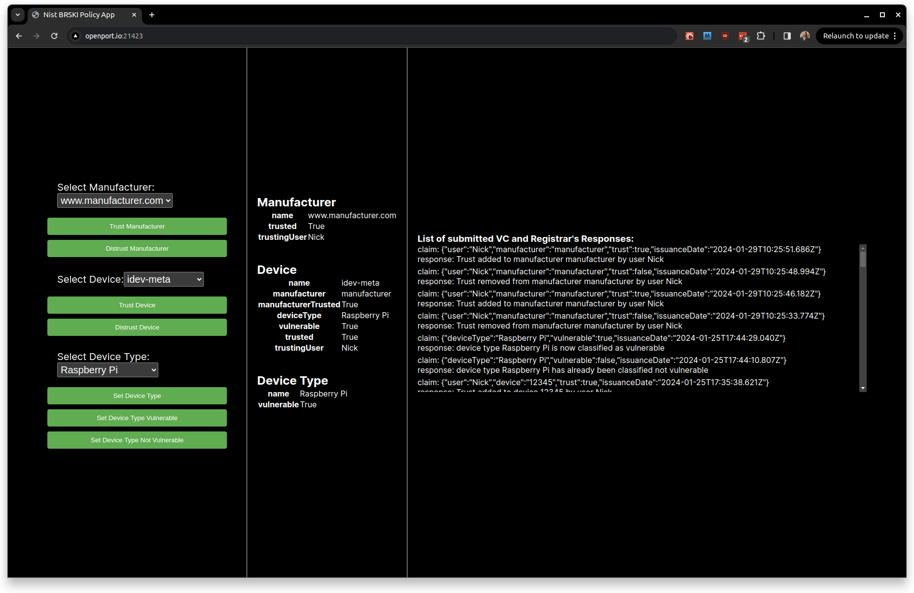

# Build 5 Registrar Web Application

The Registrar Demo App is a web-based user interface running on the access point which allows you to send sign and send verifiable credential claims as if you were a network owner.

On the supplied devices, the app can be accessed as follow:

Remotely at [https://openport.io/l/21423/5FbFMfRa0Nx9RG0i](https://openport.io/l/21423/5FbFMfRa0Nx9RG0i) or locally at [http://registrar.local:3002/](http://registrar.local:3002/)

The app is split into 3 panels, the left-most panel allows you to select, from the registrar's database, a manufacturer, a device, and a device type. The information on the middle panel reflects the information in the database on the selected entities. The right panel displays all the verifiable credential (VC) claims submitted to the registrar and the response the registrar responded with upon receiving the claim.

When a device attempts to onboard onto the access point the policy is checked on the registrar using the rust library functions, these 3 methods check the following 3 queries:

1) if the device manufacturer (the issuer of the device's IdevID) has been trusted by the network owner or someone with permissions to trust manufacturers
2) if the device is trusted by someone with permissions to permit connection of devices
3) if the device type bound to the device has any vulnerabilities above the set threshold - for the demo policy we have set if the device type has any High or Critical severity vulnerabilities as the threshold.

If the manufacturer is not found in the database it is added, and returns that it is not trusted, likewise, if the device is not found by the method used to check it's trust it is also added to the database, and an entry binding it to it's manufacturer is inserted. If the device has not been bound to a device type, which must currently be done by a sufficiently permissioned user through the UI, then the vulnerability check assumes the device is vulnerable. 

