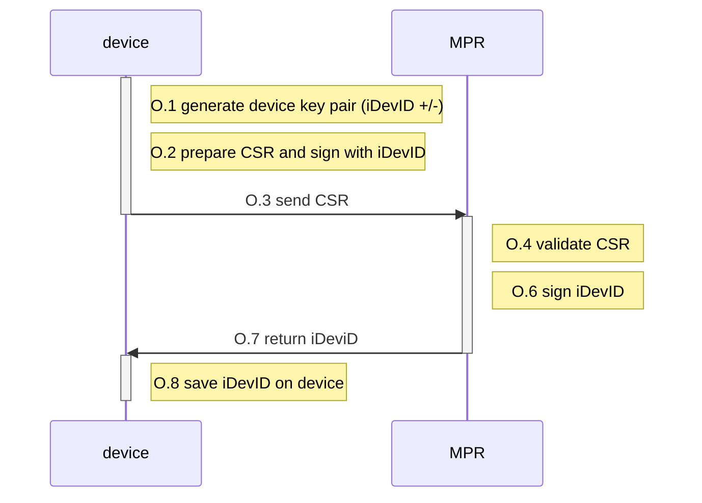

# Factory Use Case - Build 5

We will document here the practical method to fully integrate the factory use case into Build 5. The Build5 approach implements "Method 1" as outlined in the Factory Build text.

> **1.**   **[Method 1: Key Pair Generated on IoT Device](https://www.ietf.org/archive/id/draft-irtf-t2trg-taxonomy-manufacturer-anchors-02.html#name-avocado-method-on-device-pr)**
>
> Summary: Generate the private key on the device; device sends the device’s bootstrapping information (e.g., the device’s certificate or DPP URI) to the manufacturer’s database. The steps for Method 1 are:
>
> a.   The public/private key pair is generated on the device and stored in secure storage.
>
> b.   The device generates and signs a CSR structure and sends the CSR to the manufacturer’s IDevID CA, which sends a signed certificate (IDevID) back to the device.
>
> c.   If BRSKI is being supported, the device loads the certificate (IDevID) into its secure storage; if Wi-Fi Easy Connect is being supported, the device creates a DPP URI and loads that into secure storage.
>
> d.   The device sends the certificate or DPP URI to the manufacturer’s database.
>
> One disadvantage of this method is that the device’s random number generator is relied upon to generate the key pair, and it is possible that a device’s random number generator will not be as robust as the random number generator that would be included in an SE, for example. An advantage of this method is that the device’s private key is not vulnerable to disclosure, assuming the device is equipped with a strong random number generator that is used for key generation and the private key is put into secure storage immediately upon generation.

## Factory use case: overview

This version of the factory use case can be broken down into three key stages:

1. **Vanilla firmware creation**: assumes a manufacturer-defined standard firmware with an immutable manufacturer public root burned in (or accessible through TPM).
2. **iDevID provisioning**: is the process by which an iDevID can be provisioned on the device, using the manufacturer public root and the root of trust for the provisioning process and also provided the base of the address used for the provisioning process.
3. **iDevID utilization**: is the bootstrapped network onboarding process that will make use of the iDevID in the provisioning process.

The key post-conditions of each stage are as follows:

| State                     | Post Condition                                                                                                             |
| ------------------------- | -------------------------------------------------------------------------------------------------------------------------- |
| Vanilla firmware creation | - `manufacturer provisioning root` `(MPR)` as an X509 certificate is accessible at a well-known location on the device  - `MPR` cannot be changed - `MPR` contains public key(s) of the manufacturer  - `MPR` contains the base address used to initiate the provisioning process |
| iDevID provisioning       | - `iDevID` as an X509 certificate is accessible at a well-known location on the device  - `iDevID` cannot be changed - only a new one requested  - `iDevID` contains public key and based of address for the MASA |
| iDevID utilization        | - `LDevID` is provisioned on device, which can be used as credentials to access on |

## 1. Firmware creation

To simulate a static firmware, we will create a Pi image boot on a read-only SD card.

This SD contains:

- MPR in a well-known accessible location
- the iDev provisioning code

Key questions:

> Steve:
>
> - Do we store MPR on the file system of the device or on the wisekey TPM?
> - If 1), please provide the folder.
> - If 2), please provide the API and parameter to return.

> MCR/Steve: As an alternative to an SD card swap, could we create 2 partitions
>
> - Partition 1- write-only firmware simulation - containing the MCR and iDevID provisioning code
> - Partition 2 holds the BRSKI onboarding code.
>
> Logic being:
>
> - If no iDevID - call iDev provisioning on partition 1.
> - If iDevID - move execution to partition 2.
> - Option on partition 2 - to remove iDevID and reboot - to simulate a full wipe and re-provisioning.
>
> Using this method, it's easier to demo.

## iDevID provisioning

iDevID provisioning is auto-triggered from the boot partition if no iDevID is found.

iDevID provisioning is provided as static code, which deterministically calls out the Manufacturer iDevID provisioning server.

Logically, provisioning uses the following flow:

This process is a privileged event and is assumed to take place on a physically protected network. Without this constraint, any device (iDevID key pair) could register itself with the manufacturer and obtain a valid iDevID certificate.

> Steve: 
>
> Do you have the code ready to go for this? Do you need any help? 
>
> I assume this code will use a static `MCR`, and this is backed up on the service side through an accessible service.
>
> We assume this process has:
>
> a. created iDevID key pairs
>
> b. requested and installed iDevID certificate

> Steve: 
>
> Key practical questions:
>
> 1. How do we request/find the iDevID (are you putting it on the device file system or on the TPM - how do we access it)?
> 2. How do we reference the primary iDevID keys?
> 3. What API should we use to "sign" artifacts using the keys?
> 4. How do we negotiate TLS with the key (see below)?

All we need is the ability to check we have a well-formed iDevID, and we can shift to the next step.

# iDevID utilization

iDevID utilization is the full BRSKI Wi-Fi provisioning flow.

The "ideal requirements" for this process are:

1. ALL keys used for all parts of the onboarding process use the TPM
2. ALL signing operations, for all parts of the process use the TPM

The "minimal requirements" for this process are:

1. The iDevID private key is stored in the TPM.
2. The process by which artifacts are signed by the iDevID is mediated by the TPM.

Where critically

 one of the key processes that needs to be signed by the iDevID private key is the TLS session negotiation.

## Detailed reconciliation with onboarding process

In the iDevID provisioning process, the steps that need to explicitly interact with the TPM are:

- O.1 generate device key pair (iDevID +/-)
- O.2 prepare CSR and sign with iDevID

The last state O.8 save on device can be done on the device; it is not mandatory this is stored on the TPM.

In the iDevID utilization phase, and with reference to the numbering scheme defined in [../20-prot-overview.md], the following steps need to interact with the TPM:

- C.0: `iDevID` private key is needed to establish the "partial" TLS connection.
- C.1: `device` constructs `voucher request` construct request and sign it with `iDevID` private key
- D.0: `iDevID` private key is needed to establish the "full " TLS connection.

Again we assume the full iDevID certificate can be stored on the device; it is not mandatory this is stored on the TPM.

**Note**: the LDevID Lifecycle also requires manipulation of private keys. However, we deem this a "nice to have", secure implementation detail of the device, and not a mandatory part of the factory provisioning flow. The LDevID is not a direct result of the factory provisioning process, but a downstream artifact. It is a security implementation detail of the device whether this more ephemeral credential is managed by the TPM. There is also a technical reason why this is hard to achieve in the short term.

The optional steps, where the LDevID can interact with the TPM are:

- D.1 - generated LDeviID +/- key pairs
- D.2 - device constructs the CSR request for enrollment, which includes the iDeviD and is signed by LDevID
- E.1: use of LDevID in the EAP-TLS Wi-Fi connection request

The last stage is the most complex. We would have to recompile network manager or similar to make use of the specific TPM implementation.

Primarily for this reason, we are keeping LDevID TPM considerations out of scope for the initial factory provisioning proof of concept.