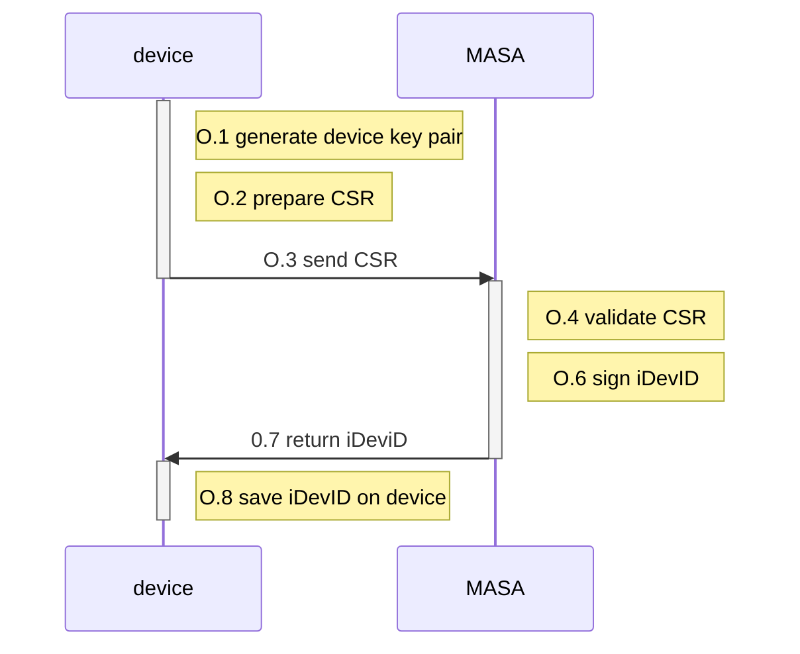

# Factory Use Case - Build 5

We will document here the practical method use shall use, to fully integrate the factory use case into Build 5. The Build5 approach implemented "Method 1" as outlined in the Factory Build text

> **1.**   **[Method 1: Key Pair Generated on IoT Device](https://www.ietf.org/archive/id/draft-irtf-t2trg-taxonomy-manufacturer-anchors-02.html#name-avocado-method-on-device-pr)**
>
> Summary: Generate the private key on the device; device sends the device’s bootstrapping information (e.g., the device’s certificate or DPP URI) to the manufacturer’s database. The steps for Method 1 are:
>
> a.   The public/private key pair is generated on the device and stored in secure storage.
>
> b.   The device generates and signs a CSR structure and sends the CSR to the manufacturer’s IDevID CA, which sends a signed certificate (IDevID) back to the device.
>
> c.   If BRSKI is being supported, the device loads the certificate (IDevID) into its secure storage; if Wi-Fi Easy Connect is being supported, the device creates a DPP URI and loads that into secure storage.
>
> d.   The device sends the certificate or DPP URI to the manufacturer’s database.
>
> One disadvantage of this method is that the device’s random number generator is being relied upon to generate the key pair, and it is possible that a device’s random number generator will not be as robust as the random number generator that would be included in an SE, for example. An advantage of this method is that the device’s private key is not vulnerable to disclosure, assuming the device is equipped with a strong random number generator that is used for key generation and the private key is put into secure storage immediately upon generation. 

## Factory use case: overview

This version of the factory use can be broken down into three key stages

1. **Vanilla firmware creation**: assumes a manufacturer defined standard firmware with an immutable manufacturer public root burned in (or accessible through TPM)
2. **iDevID provisioning**: is the process by which an iDevID can be provisioned on on the device, using the manufacturer public root and the root of trust for the provisioning process and also provided the base of the address used for the provisioning process 
3. **iDevID utilisation**: is the bootstrapped network onboarding process that will make use if the iDevID in the provisioning process

The key post conditions of each stage are as follows

| State                     | Post Condition                                               |
| ------------------------- | ------------------------------------------------------------ |
| Vanilla firmware creation | `manufacturer provisioning root` `(MPR)`as an X509 certificate is accessible at a well known location on the device  `MPR` cannot be changed `MPR` contains public key (s) of manufacture  `MPR` contains base of address used to initiate the provisioning process |
| iDevID provisioning       | `iDevID` as an X509 certificate is accessible at a well known location on the device  `iDevID` cannot be changed - only a new one requested   `iDevID` contains pubic key and based of address for the MASA |
| iDevID utilisation        | `LDevID` is provisioned on device, which can be used as credentials to access on |

## 1. Firmware creation

To simulate a static firmware we will create a PI image boot on a read only SD card.

This SD contains:

* MPR in an well known accessible location
* the iDev provisioning code 

Key questions

> Steve: 
>
> * do we store MPR on the file system of the device or on the wisekey TPM
> * if 1) please provide the folder 
> * if 2) please provide the API and parameter to return 

> MCR/Steve: as an alternative to an SD card swap could we create 2 partitions
>
> 1. partition 1- write only firmware simulation - containing the MCR and iDevID provisioning code 
> 2. partition 2 holds the BRSKI onboarding code.
>
> Logic being
>
> - if no iDevID - call iDev provisioning on partiotion 1
> - if iDevD - move execution to partition 2.
> - Option on partition 2 - to remove iDevID and reboot - to simulate a full wipe and re-provisioning.
>
> Using this methods its easier to demo 

## iDevID provisioning

iDevID provisioning is auto triggered from the boot partition if no iDevID is found.

iDevID provisioning, is provided as static code, which deterministically calls out the Manufacturer IDevID provisioning server .

Logically provisioning uses the following flow 

> Steve: 
>
> Do you have the code ready to go for this? Do you need any help 
>
> I assume this code will use a static `MCR` and this is is backed up on the service side through an accessible service
>
> We assume this process has
>
> a. created iDevID key pairs
>
> b. requested and installed iDevID certificate 

> Steve: 
>
> Key practical questions
>
> 1. How to request/find the iDevID ( are you putting on device file system on on the TPM - how do we access?)
> 2. How to we reference the primary iDevID keys 
> 3. What API should we use to "sign" artefacts using the keys 
> 4. How to we negotiate TLS with key (see below) 

All we need is the ability to check we have a well formed iDevID, and we can shift to the next step 

# iDevID utilisation 

The iDevID utilisation, is the full BRKSI WIFI provisioning flow.

The "ideal requirements" for this process are

1. ALL keys used for all parts of the onboarding process use the TPM
2. ALL signing operations, for all parts of the process use the TPM

The "minimal requirements" for this process are

1. The iDevID private key is stored in the TPM
2. The process by which artefacts are signed by the iDevID are mediated by the TPM

Where critically one of the key processes that needs to be signed by the iDevID private key, is the TLS session negotiation.

## Detailed reconciliation with onboarding process

In the iDevID provisioning process 

* O.1 generate device key pair (iDevID +/-)
* O.2 prepare CSR and sign with iDevID

The last state O.8 save on device, can be done on the device; it is not mandatory this is stored on the TPM 

For 

Using the numbering scheme defined in [../20-prot-overview.md] 

* O.1 generate device key pair (iDevID +/-)
* O.2 prepare CSR and sign with iDevID
* C.1: `device` constructs `voucher request` construct request and sign it with `iDevID` private key
* D.1 - device constructs the CSR request for enrolment, which includes the iDeviD and is signed by iDeviD-

ce: O.1 generate device key pair (iDevID +/-)
    Note right of device: O.2 prepare CSR and sign with iDevID

## Factory use case: preconditions

Before we trigger the CSR provisioning we expect the following conditions to be met.

1. The device in question is setup with a standard firmware image
2. This image contains a root certificate of the MASA
3. The root certificate of the MASA contains the URI
4. We have established a common URI end point to which we will present the CSR

:exclamation: :exclamation:  are we are integrating with WISEKEY CA:exclamation: :exclamation:

#### Implementation

> To implement the above we can manually create the openssl commands to issue a new MASA public key and manually put on the device
>
> ?? Do we need to/want to store in wisekey trusted storages
>
> Is there a universal method by which this is retrieved 

1. Get iDeviD 

## Current implementation

The current implementation of the key components is in the following public repo

https://github.com/nqminds/brski 

The bindings to the dependent SSL functions are defined in the following header file 

https://github.com/nqminds/brski/blob/main/src/voucher/crypto.h

There are two implementation: an Open SSL binding 

https://github.com/nqminds/brski/blob/main/src/voucher/crypto_ossl.c

And an optional (not fully complete) wolfssl binding 

https://github.com/nqminds/brski/blob/main/src/voucher/crypto_wssl.c

## Factory use case: data flows

??

## Physical setup and installation

> What do we need to know here  ??

##  API Integration with Wisekey-Build 5

The full wisely build integration needs to identify the specific integration points wiht the code and identify any certificate formats that need aligning 

### O.1 generate device key pair

:exclamation: :exclamation:  need to call wisekey gey gen operations :exclamation: :exclamation:

which from our side i think is here

https://github.com/nqminds/brski/blob/8db9d5d94bf0d529531f2ccd9c4c87be32e81f5e/src/voucher/crypto_ossl.c#L455

question is does the wisekey bind invisibly to the openSSL if we link differently 

### O.2 prepare CSR

Use normal OpenSSL functions

We assume this is not impacted by and wisekey code 

### O.3 send CSR

Does this have to be EST - or simple rest (curl command )?

### O.4-6 MASA bits

I suggest in the first instance we just use the existing MASA implementation - wiht a new HTTP endpoint for iDevID provisioning 

Should we agree and URI

We can add a wisekey CA later - but not sure it really demonstrates anything substantive, with regards to the 

### O.7 return iDeviD

Simply the inverse of O.3

### O.8 install iDeviD 

Where do we want to put it. On device or TPM

is there a universal access method 