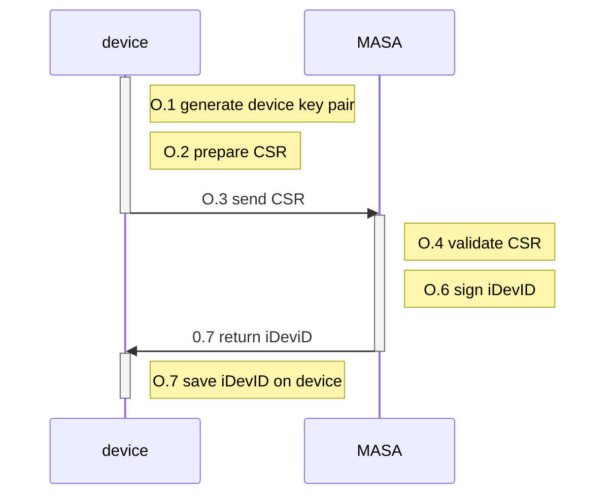

# Factory Use Case - Build 5

We will document here the practical method use shall use, to fully integrate the factory use case into Build 5. The Build5 approach implemented "Method 1" as outlined in the Factory Build text

> **1.**   **[Method 1: Key Pair Generated on IoT Device](https://www.ietf.org/archive/id/draft-irtf-t2trg-taxonomy-manufacturer-anchors-02.html#name-avocado-method-on-device-pr)**
>
> Summary: Generate the private key on the device; device sends the device’s bootstrapping information (e.g., the device’s certificate or DPP URI) to the manufacturer’s database. The steps for Method 1 are:
>
> a.   The public/private key pair is generated on the device and stored in secure storage.
>
> b.   The device generates and signs a CSR structure and sends the CSR to the manufacturer’s IDevID CA, which sends a signed certificate (IDevID) back to the device.
>
> c.   If BRSKI is being supported, the device loads the certificate (IDevID) into its secure storage; if Wi-Fi Easy Connect is being supported, the device creates a DPP URI and loads that into secure storage.
>
> d.   The device sends the certificate or DPP URI to the manufacturer’s database.
>
> One disadvantage of this method is that the device’s random number generator is being relied upon to generate the key pair, and it is possible that a device’s random number generator will not be as robust as the random number generator that would be included in an SE, for example. An advantage of this method is that the device’s private key is not vulnerable to disclosure, assuming the device is equipped with a strong random number generator that is used for key generation and the private key is put into secure storage immediately upon generation. 

## Factory use case: preconditions

Before we trigger the CSR provisioning we expect the following conditions to be met.

1. The device in question is setup with a standard firmware image
2. This image contains a root certificate of the MASA
3. The root certificate of the MASA contains the URI
4. We have established a common URI end point to which we will present the CSR

:exclamation: :exclamation:  are we are integrating with WISEKEY CA:exclamation: :exclamation:

#### Implementation

> To implement the above we can manually create the openssl commands to issue a new MASA public key and manually put on the device
>
> ?? Do we need to/want to store in wisekey trusted storages
>
> Is there a universal method by which this is retrieved 

## Current implementation

The current implementation of the key components is in the following public repo

https://github.com/nqminds/brski 

The bindings to the dependent SSL functions are defined in the following header file 

https://github.com/nqminds/brski/blob/main/src/voucher/crypto.h

There are two implementation: an Open SSL binding 

https://github.com/nqminds/brski/blob/main/src/voucher/crypto_ossl.c

And an optional (not fully complete) wolfssl binding 

https://github.com/nqminds/brski/blob/main/src/voucher/crypto_wssl.c

## Factory use case: data flows

## Physical setup and installation

> What do we need to know here  ??

##  API Integration with Wisekey-Build 5

The full wisely build integration needs to identify the specific integration points wiht the code and identify any certificate formats that need aligning 

### O.1 generate device key pair

:exclamation: :exclamation:  need to call wisekey gey gen operations :exclamation: :exclamation:

which from our side i think is here

https://github.com/nqminds/brski/blob/8db9d5d94bf0d529531f2ccd9c4c87be32e81f5e/src/voucher/crypto_ossl.c#L455

question is does the wisekey bind invisibly to the openSSL if we link differently 

### O.2 prepare CSR

Use normal OpenSSL functions

We assume this is not impacted by and wisekey code 

### O.3 send CSR

Does this have to be EST - or simple rest (curl command )?

### O.4-6 MASA bits

I suggest in the first instance we just use the existing MASA implementation - wiht a new HTTP endpoint for iDevID provisioning 

Should we agree and URI

We can add a wisekey CA later - but not sure it really demonstrates anything substantive, with regards to the 

### O.7 return iDeviD

Simply the inverse of O.3

### O.8 install iDeviD 

Where do we want to put it. On device or TPM

is there a universal access method 