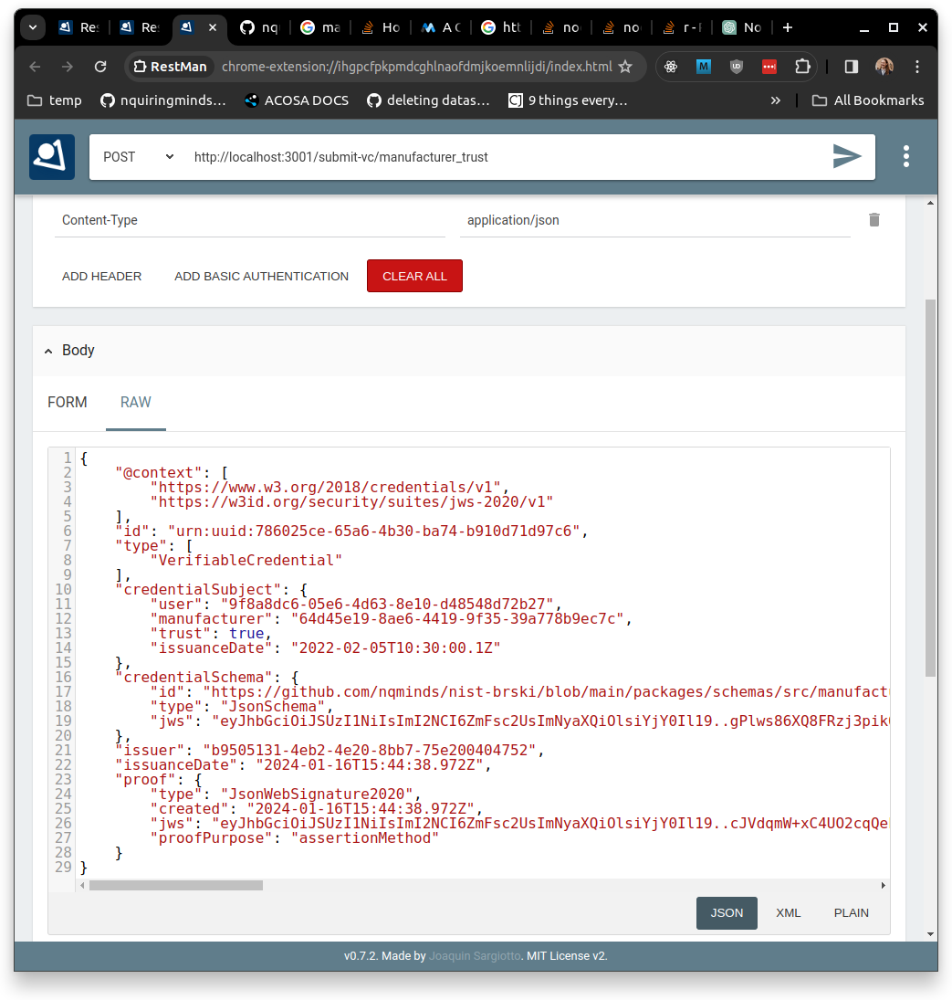

# Nist Registrar Server

This is the REST API server which should run on the registrar and accept VCs containing claims, it verifies the VC with the VC Rest API and if the VC successfully verifies then the information claimed in the VCs is acted upon to update the information in sqlite database to reflect the claim.

In order for this to work you must first following the instructions to set up the @nqminds/nist_vc_rest_server and get it running on the same machine as this server. In order for the server to work correctly the following fields in the config file must be pointed at the appropriate targets:

sqliteDBPath: The path to the sqlite database which contains the information your registrar knows, if database file doesn't exist server will create one a populate it with demo data containing nqminds' users. Example databases exist [here](https://github.com/nqminds/nist-brski/tree/nist_policy_rust_library/packages/nist_policy/tests).
nistVcRestServerAddress: The http address of the running @nqminds/nist_vc_rest_server server

## Setup

### Step 1
Follow [instructions to setup and run the NIST VC Rest API](https://github.com/nqminds/nist-brski/blob/main/packages/nist_vc_rest_server/README.md)

### Step 2
Copy the address at which the NIST VC Rest API is running into the `config.json` file.

### Step 3 (Optional)
Copy the path to the sqlite database file you wish to manage the state of the information the registrar knows about users, manufacturers, devices etc... If left as default it will be instantiated and populated with demo data.

### Step 4
Run `npm run dev` to run the rest API.

## Usage

### Step 1
Create a claim you wish to make following a [VC schema](https://github.com/nqminds/nist-brski/blob/main/packages/schemas/README.md).

### Step 2
Follow [the instructions to use the nist VC rest to sign your VC](https://github.com/nqminds/nist-brski/blob/main/packages/nist_vc_rest_server/README.md)

### Step 3
Make a post request to submit your VC to the registrar specifying the schema_name in the post request parameter like so `{address}/submit-vc/{schema_name}`, it will attempt to verify your VC using the NIST VC Rest API and action the claim made by the VC to update the sqlite database.

In this example I've posted a VC which states that user with id "9f8a8dc6-05e6-4d63-8e10-d48548d72b27" trusts manufacturer with id "64d45e19-8ae6-4419-9f35-39a778b9ec7c".

However, since a manufacturer with that ID is not in the database it has responded with `No manufacturer with id or name 64d45e19-8ae6-4419-9f35-39a778b9ec7c`.

