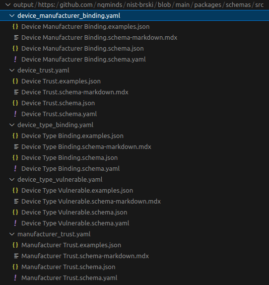
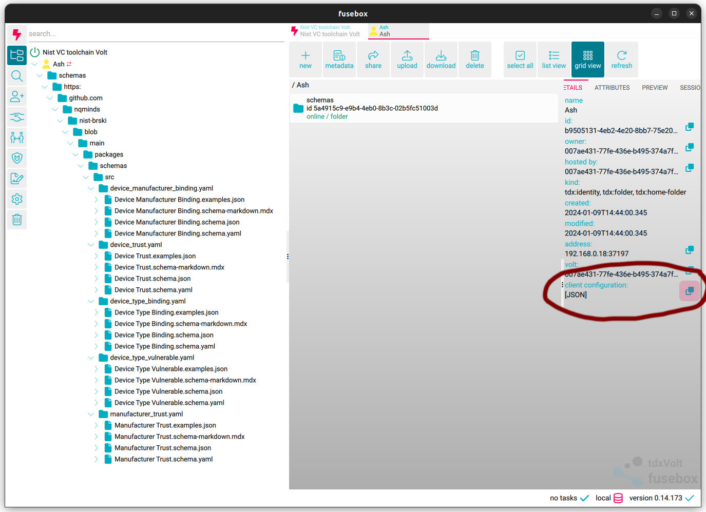

# Schemas directory

## To populate a volt with the schemas and set it up for the VC toolchain

### Step 0 

### `npm i -g @nqminds/verifiable-schemas-toolchain`
This installs the VC toolchain utilities from https://github.com/nqminds/vc-toolchain such that they may be used globally on the command line.

### Install volt cmd line interface and fusebox from https://docs.tdxvolt.com/en/getting-started/quick-start

### Step 1 - `npm run prepare` 
This runs the command `schemaTools parse-yaml-files ./src`. This validates the yaml schemas for the VCs in the src directory and generates the required documentatation & json files in the `./output` directory.

The directory structure should now look like so:


### Step 2 - `schemaTools init --config volt.config.json`
Where the volt.config.json is a volt config file exported for a user on a volt, this initialises the volt connection & builds the schema directory.



### Step 3 - `volt up ./output/* schemas`
This uploads the output files to the schema directory, the structure in the volt should look like so:


## To create new schemas

To create a new schema run, navigate to src and run:
```bash
  schemaTools new-schema <schema_name>
```

This will create a blank schema.yaml for you to edit:

```yaml
$id: SCHEMA_ID                                          # Typically the URL (in github of where this schema is - it will need to be unique)
$schema: https://json-schema.org/draft/2019-09/schema
title: SCHEMA_TITLE                                     # The title of your schema
description: SCHEMA_DESCRIPTION                         # Schema description
type: object
properties:                                             # Define schema properties here
  FIELD: 
    type: FIELD_TYPE
    description: FIELD_DESCRIPTION
required:
  - PROPERTY_ID                                         # Required fields
examples:
  - EXAMPLE: EXAMPLE_DATA                               # Example data
```